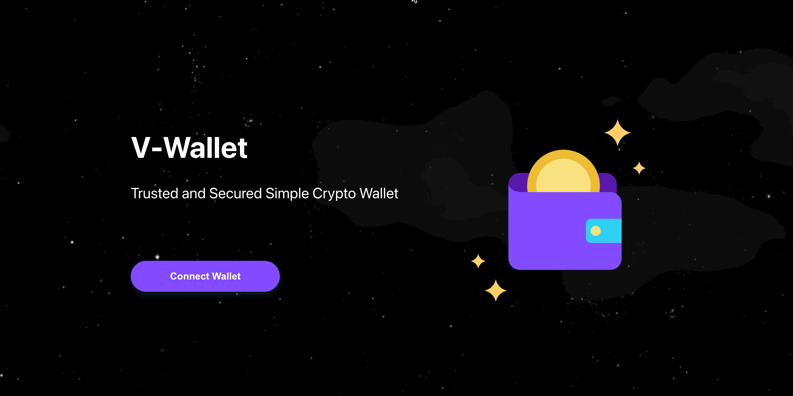
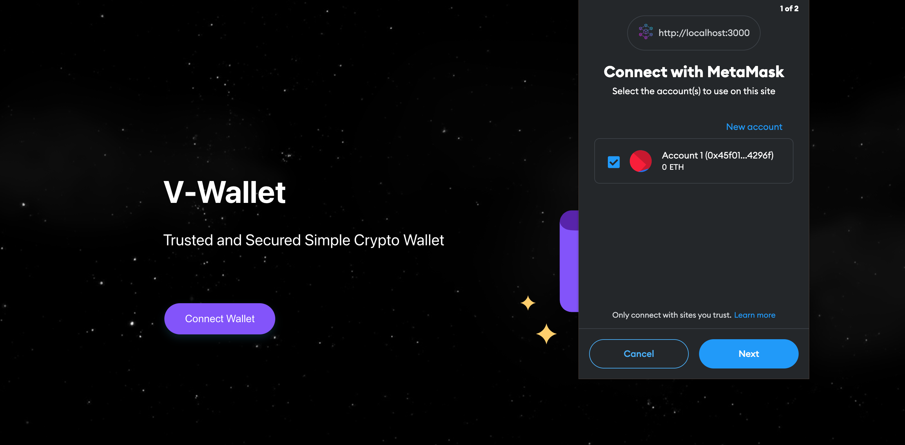
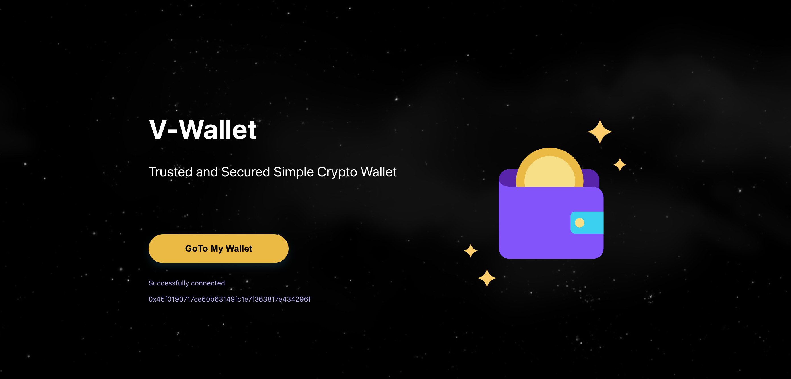
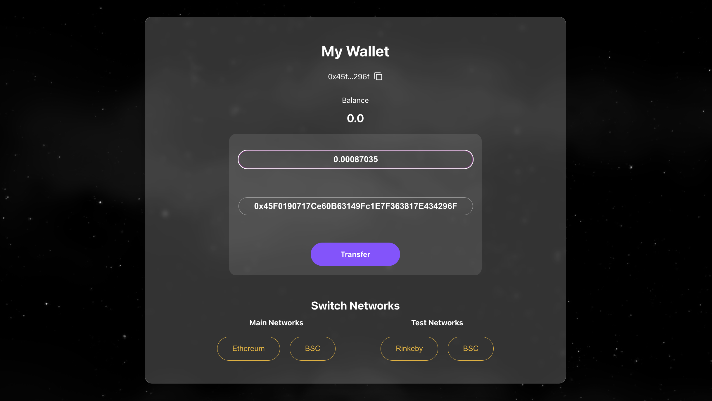

# V-Wallet (with MetaMask)

This project is developed for learning purposes.  
It contains MetaMask integration, wallet connect, change network, show balance and transfer.

## Demo
Visit https://v-wallet-eight.vercel.app/

## Screenshots

1. Homepage

 

2. Connect Wallet

 

3. After Connected

 

4. My Wallet Dashboard

 

## How to Run

Make sure you already install MetaMask as your browser extension. Download here https://metamask.io/download/

In the project directory, you can run:

### `yarn install`

To install packages and dependencies

### `yarn start`

Runs the app in the development mode.

### `yarn build`

The build is minified and the filenames include the hashes.\
Your app is ready to be deployed!
