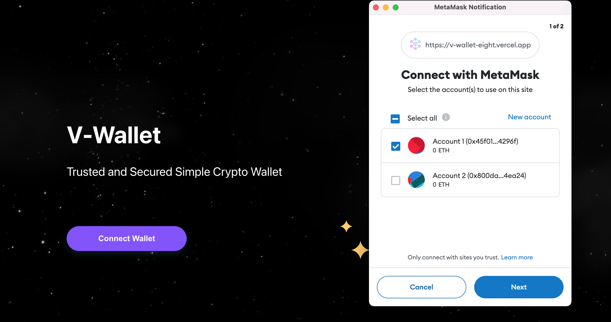

# V-Wallet (with MetaMask)

This project contains MetaMask integration, wallet connect, change network, show balance and transfer.

## Demo
I've been deployed to Vercel. Visit https://v-wallet-eight.vercel.app/

## Screenshots

1. Homepage

 

2. Connect Wallet

 

3. After Connected

 

4. My Wallet Dashboard

 

## How to Run

Make sure you already install MetaMask as your browser extension. Download here https://metamask.io/download/  

To test transaction, i'm using testing network Sepolia to get some ETH from faucet https://www.infura.io/faucet  

In the project directory, you can run:

### `yarn install`

To install packages and dependencies

### `yarn start`

Runs the app in the development mode.

### `yarn build`

To deploy on production mode.

## Contact
Visit https://vanydiah.carrd.co

I'm new in Web 3.0, Crypto, Blokchain and excited to learn more about it. Any inputs are welcome 😊